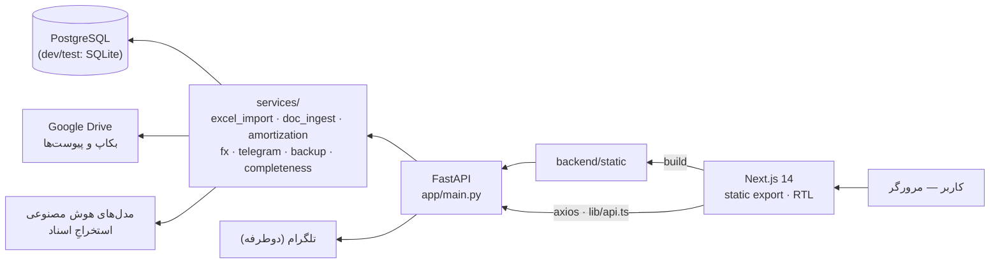
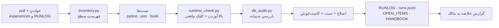

# جزوهٔ ناظرِ خودکار — نقشهٔ سامانه و روندِ پیشرفت

> ساخته‌شده به‌صورت **خودکار** در 2026-09-26 03:44 UTC — دستی ویرایش نکن.
> منبع: `inventory.json` + `runs.jsonl` · تعدادِ اجراهای ثبت‌شده: **3**

## ۱) سامانه در یک نگاه

| سنجه | مقدار |
|---|---|
| صفحه‌ها | 32 |
| آیتم‌های منو | 19 |
| دکمه‌ها | 334 |
| ورودی‌ها | 342 |
| مسیرهای API | 213 |
| متدهای کلاینتِ API | 170 |
| سرویس‌های بک‌اند | 39 |
| مدل‌های داده | 26 |

## ۲) معماری



## ۳) منوها و صفحه‌ها

```mermaid
flowchart TD
    ROOT["منوی کناری"]
    ROOT --> M0["Dashboard<br/><code>/dashboard</code>"]
    ROOT --> M1["Customers<br/><code>/customers</code>"]
    ROOT --> M2["Facilities<br/><code>/facilities</code>"]
    ROOT --> M3["Mortgaged Properties<br/><code>/properties</code>"]
    ROOT --> M4["Forms<br/><code>/forms</code>"]
    ROOT --> M5["General Checklists<br/><code>/general</code>"]
    ROOT --> M6["Personal Notes<br/><code>/personal</code>"]
    ROOT --> M7["Staff Directory<br/><code>/staff</code>"]
    ROOT --> M8["Daily Log<br/><code>/daily-log</code>"]
    ROOT --> M9["Knowledge Base<br/><code>/knowledge</code>"]
    ROOT --> M10["Reports<br/><code>/reports</code>"]
    ROOT --> M11["Charge Tariff<br/><code>/charge-tariff</code>"]
    ROOT --> M12["Data Quality<br/><code>/data-quality</code>"]
    ROOT --> M13["Import<br/><code>/import</code>"]
    ROOT --> M14["Users<br/><code>/users</code>"]
    ROOT --> M15["Audit Log<br/><code>/audit</code>"]
    ROOT --> M16["Database Cleanup<br/><code>/cleanup</code>"]
    ROOT --> M17["Settings<br/><code>/settings</code>"]
    ROOT --> M18["Recycle Bin<br/><code>/trash</code>"]
```



## ۴) چرخهٔ خودِ ناظر



## ۵) روندِ پیشرفت

### سلامتِ اجرا

```mermaid
xychart-beta
    title "مشکلاتِ باز در هر اجرا"
    x-axis ["09-23", "09-23", "09-26"]
    y-axis "مورد" 0 --> 7
    line [4, 5, 5]
```

### پوششِ تست

```mermaid
xychart-beta
    title "تعدادِ تست‌های سبز"
    x-axis ["09-23", "09-23", "09-26"]
    y-axis "تست" 0 --> 1253
    line [863, 1009, 1044]
```

### کیفیتِ داده

> _نمودارِ «میانگینِ کاملیِ پروفایل‌ها (٪)» بعد از دومین اجرا ساخته می‌شود._

### گسترشِ سامانه

```mermaid
xychart-beta
    title "تعدادِ مسیرهای API"
    x-axis ["09-23", "09-23", "09-26"]
    y-axis "مسیر" 0 --> 256
    line [213, 213, 213]
```


## ۶) آخرین اجرا

| سنجه | مقدار |
|---|---|
| تاریخ | 2026-09-26 |
| وضعیت | two-fixed |
| تست‌های سبز | 1044 (▲35) |
| صفحه‌های بررسی‌شده | 31 |
| دکمه‌های کلیک‌شده | 124 |
| endpointهای بررسی‌شده | 60 |
| مشکلاتِ باز | 5 |
| دیتابیسِ بازرسی‌شده | local sqlite (production unreachable) |

## ۷) کجا چه چیزی است

| فایل | نقش |
|---|---|
| `docs/supervisor/PROMPT.md` | دستورِ کاملِ ناظر (نسخه‌دار) |
| `docs/supervisor/archive/` | نسخه‌های قبلیِ دستور |
| `docs/supervisor/RUNLOG.md` | گزارشِ هر اجرا |
| `docs/supervisor/OPEN_ITEMS.md` | کارهای بازِ انتقالی |
| `docs/supervisor/runs.jsonl` | سنجه‌های هر اجرا (منبعِ نمودارها) |
| `docs/supervisor/INVENTORY.md` | فهرستِ خودکارِ سطحِ سامانه |
| `scripts/supervisor/` | اسکریپت‌هایی که ناظر اجرا می‌کند |
