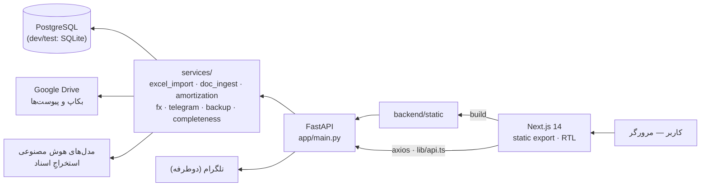
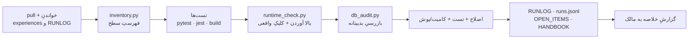
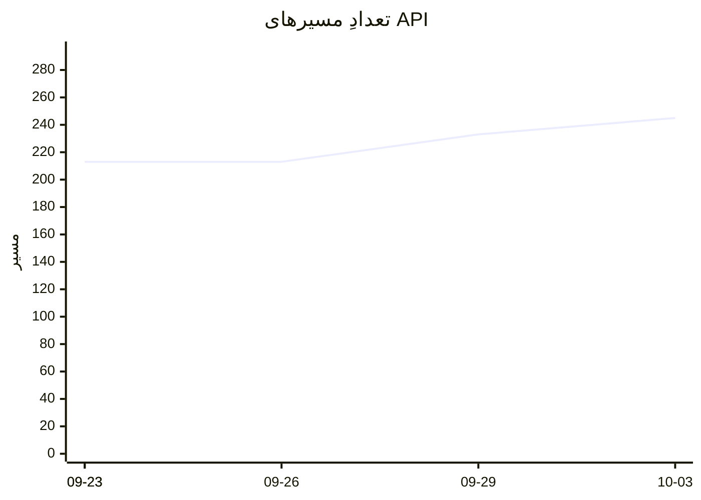

# جزوهٔ ناظرِ خودکار — نقشهٔ سامانه و روندِ پیشرفت

> ساخته‌شده به‌صورت **خودکار** در 2026-10-06 03:32 UTC — دستی ویرایش نکن.
> منبع: `inventory.json` + `runs.jsonl` · تعدادِ اجراهای ثبت‌شده: **5**

## ۱) سامانه در یک نگاه

| سنجه | مقدار |
|---|---|
| صفحه‌ها | 34 |
| آیتم‌های منو | 20 |
| دکمه‌ها | 371 |
| ورودی‌ها | 358 |
| مسیرهای API | 245 |
| متدهای کلاینتِ API | 193 |
| سرویس‌های بک‌اند | 42 |
| مدل‌های داده | 28 |

## ۲) معماری

```mermaid
flowchart RL
    U["کاربر — مرورگر"] --> FE["Next.js 14<br/>static export · RTL"]
    FE -->|build| ST["backend/static"]
    ST --> API["FastAPI<br/>app/main.py"]
    FE -->|axios · lib/api.ts| API
    API --> SVC["services/<br/>excel_import · doc_ingest · amortization<br/>fx · telegram · backup · completeness"]
    SVC --> DB[("PostgreSQL<br/>(dev/test: SQLite)")]
    SVC --> DRV["Google Drive<br/>بکاپ و پیوست‌ها"]
    SVC --> AI["مدل‌های هوش مصنوعی<br/>استخراجِ اسناد"]
    API --> MT["تلگرام (دوطرفه)"]
```

## ۳) منوها و صفحه‌ها

```mermaid
flowchart TD
    ROOT["منوی کناری"]
    ROOT --> M0["Dashboard<br/><code>/dashboard</code>"]
    ROOT --> M1["Customers<br/><code>/customers</code>"]
    ROOT --> M2["Facilities<br/><code>/facilities</code>"]
    ROOT --> M3["Mortgaged Properties<br/><code>/properties</code>"]
    ROOT --> M4["Forms<br/><code>/forms</code>"]
    ROOT --> M5["General Checklists<br/><code>/general</code>"]
    ROOT --> M6["Personal Notes<br/><code>/personal</code>"]
    ROOT --> M7["Staff Directory<br/><code>/staff</code>"]
    ROOT --> M8["Daily Log<br/><code>/daily-log</code>"]
    ROOT --> M9["Knowledge Base<br/><code>/knowledge</code>"]
    ROOT --> M10["Reports<br/><code>/reports</code>"]
    ROOT --> M11["Charge Tariff<br/><code>/charge-tariff</code>"]
    ROOT --> M12["Data Quality<br/><code>/data-quality</code>"]
    ROOT --> M13["Import<br/><code>/import</code>"]
    ROOT --> M14["Users<br/><code>/users</code>"]
    ROOT --> M15["نظارت و سرکشی<br/><code>/inspection</code>"]
    ROOT --> M16["Audit Log<br/><code>/audit</code>"]
    ROOT --> M17["Database Cleanup<br/><code>/cleanup</code>"]
    ROOT --> M18["Settings<br/><code>/settings</code>"]
    ROOT --> M19["Recycle Bin<br/><code>/trash</code>"]
```

## ۴) چرخهٔ خودِ ناظر

```mermaid
flowchart LR
    A["pull + خواندنِ<br/>experiences و RUNLOG"] --> B["inventory.py<br/>فهرستِ سطح"]
    B --> C["تست‌ها<br/>pytest · jest · build"]
    C --> D["runtime_check.py<br/>بالا آوردن + کلیکِ واقعی"]
    D --> E["db_audit.py<br/>بازرسیِ بدبینانه"]
    E --> F["اصلاح + تست + کامیت/پوش"]
    F --> G["RUNLOG · runs.jsonl<br/>OPEN_ITEMS · HANDBOOK"]
    G --> H["گزارشِ خلاصه به مالک"]
```

## ۵) روندِ پیشرفت

### سلامتِ اجرا

```mermaid
xychart-beta
    title "مشکلاتِ باز در هر اجرا"
    x-axis ["09-23", "09-23", "09-26", "09-29", "10-03"]
    y-axis "مورد" 0 --> 11
    line [4, 5, 5, 7, 9]
```

### پوششِ تست

```mermaid
xychart-beta
    title "تعدادِ تست‌های سبز"
    x-axis ["09-23", "09-23", "09-26", "09-29", "10-03"]
    y-axis "تست" 0 --> 1625
    line [863, 1009, 1044, 1163, 1354]
```

### کیفیتِ داده

```mermaid
xychart-beta
    title "میانگینِ کاملیِ پروفایل‌ها (٪)"
    x-axis ["09-29", "10-03"]
    y-axis "درصد" 0 --> 10
    line [8, 8]
```

### گسترشِ سامانه

```mermaid
xychart-beta
    title "تعدادِ مسیرهای API"
    x-axis ["09-23", "09-23", "09-26", "09-29", "10-03"]
    y-axis "مسیر" 0 --> 295
    line [213, 213, 213, 233, 245]
```

## ۶) آخرین اجرا

| سنجه | مقدار |
|---|---|
| تاریخ | 2026-10-03 |
| وضعیت | green-seven-sheets-answered |
| تست‌های سبز | 1354 (▲191) |
| صفحه‌های بررسی‌شده | 33 |
| دکمه‌های کلیک‌شده | 171 |
| endpointهای بررسی‌شده | 67 |
| مشکلاتِ باز | 9 (▲2) |
| دیتابیسِ بازرسی‌شده | production over HTTPS (100% of the book) + local sqlite for db_audit |

## ۷) کجا چه چیزی است

| فایل | نقش |
|---|---|
| `docs/supervisor/PROMPT.md` | دستورِ کاملِ ناظر (نسخه‌دار) |
| `docs/supervisor/archive/` | نسخه‌های قبلیِ دستور |
| `docs/supervisor/RUNLOG.md` | گزارشِ هر اجرا |
| `docs/supervisor/OPEN_ITEMS.md` | کارهای بازِ انتقالی |
| `docs/supervisor/runs.jsonl` | سنجه‌های هر اجرا (منبعِ نمودارها) |
| `docs/supervisor/INVENTORY.md` | فهرستِ خودکارِ سطحِ سامانه |
| `scripts/supervisor/` | اسکریپت‌هایی که ناظر اجرا می‌کند |
